# ML-Music-recommendation-engine

**Team Members :** Antony Carrard, Anne Sophie Ganguillet, Dalia Maillefer, Killian Vervelle

**Date :** 9 juin 2023

## Project: Music recommendation engine from the Million Song Dataset

### Contexte
Recommendation engines, already well established on the internet, such as those of Amazon or Spotify, are recognized for their performance, but above all for their accessibility and ease of use. The project aligns with this trend and will lead to the development of a music recommendation engine based on statistical methods, Scala, and MLlib. 

### Data source

The data subset is available in the git repository, directly within the Scala project at the following path: "Scala/src/main/data/data.parquet". It is tracked by Git LFS (Git Large File Storage) to avoid limiting the performance of the project directory.

If you wish to regenerate the data subset (allow 20-30 minutes), please follow these steps:
```
  python -m venv venv
  source ./venv/bin/activate
  pip install --upgrade pip
  pip install -r requirements.txt
  python main.py
```

### Dataset Description
To begin with, we started with a dataset published by Audioscrobbler, the recommendation engine of Last.fm, one of the major radio websites. According to their README, the dataset is continuously growing. However, we only have access to an earlier version, dating back to May 6, 2005, and is very limited in terms of data categories. Therefore, we decided to switch to another open-source dataset called "the Million Song Dataset." The dataset consists of one million samples of song analyses, which amounts to a total size of 280 GB. The dataset includes the following categories:

```
| Field Name               | Type       | Description                              |
|--------------------------|------------|------------------------------------------|
| artist hotttnesss        | float      | algorithmic estimation                   |
| artist id                | string     | Echo Nest ID                             |
| artist latitude          | float      | latitude                                 |
| artist location          | string     | location name                            |
| artist longitude         | float      | longitude                                |
| artist name              | string     | artist name                              |
| beats confidence         | array float| confidence measure                       |
| beats start              | array float| result of beat tracking                  |
| duration                 | float      | in seconds                               |
| energy                   | float      | energy from listener point of view       |
| key                      | int        | key the song is in                       |
| key confidence           | float      | confidence measure                       |
| loudness                 | float      | overall loudness in dB                   |
| mode                     | int        | major or minor                           |
| mode confidence          | float      | confidence measure                       |
| release                  | string     | album name                               |
| similar artists          | array str  | Echo Nest artist IDs (sim. unpublished)  |
| song hotttnesss          | float      | algorithmic estimation                   |
| tempo                    | float      | estimated tempo in BPM                   |
| time signature           | int        | estimate of number of beats per bar      |
| time signature confidence| float      | confidence measure                       |
| title                    | string     | song title                               |
| year                     | int        | song release year from MusicBrainz or 0  |

```

Our models will be trained on a sample of 10,000 songs. The data will be retrieved from a 1GB sample containing 10,000 songs with a wide variety, in .h5 format. They will then be transformed into .csv and finally into .parquet.

### Description of the features used and data augmentation 

For artist clustering, we used the following features: :   
```
|artist_id: String,
|artist_name: String,
|artist_location: String,
|artist_latitude: Float,
|artist_longitude: Float,
|nbSong : Int,
|avgSongDuration: Float,
|avgSongLoudness: Float,
|avgTempo: Float,
|yearFirstSong: Int,
|yearLastSong: Int,
|avgLoudness: Float,
|avgEnergy: Float
```

For the clustering based on music genre, we used the following features:
```
|duration = Float
|key = Int
|loudness = Float
|tempo = Float
|time_signature = Int
```

For supervised classification on musical genre (multiple layer perceptron, decision tree, random forest), we used the following features:
```
|loudness = Float
|tempo = Float
|duration = Float
|time_signature = Int
```

To address the first two questions, we utilized data augmentation to generate the locality of artists from their geographical coordinates using the Geopy library.

### Questions

The scope of the project adresses 4 questions:
- **Question 1 :** What are the most popular genres? Which year has the highest number of songs produced? Which country has the largest number of artists?
- **Question 2 :** What is the average loudness and average BPM (beats per minute) per music genre?
- **Question 3 :** How can we predict the music genre based on the characteristics of other songs (loudness, tempo, key, duration) -> Machine learning
- **Question 4 :** In the context of recommending an artist to a user, how can we measure the similarity between artists? -> Machine learning

### Data preprocessing

For the classification in question 3, several preprocessing methods were applied to the data. Here is the initial state of the features before preprocessing:

```
             tempo      loudness  time_signature      duration
count  10000.000000  10000.000000    10000.000000  10000.000000
mean     122.915449    -10.485668        3.564800    238.507518
std       35.184412      5.399788        1.266239    114.137514
min        0.000000    -51.643000        0.000000      1.044440
25%       96.965750    -13.163250        3.000000    176.032200
50%      120.161000     -9.380000        4.000000    223.059140
75%      144.013250     -6.532500        4.000000    276.375060
max      262.828000      0.566000        7.000000   1819.767710
```

```
tempo               0
loudness            0
beats_start         0
time_signature      0
duration            0
artist_genre      155
```

The methods applied include:

- Removing songs with excessively high or low durations.
- Removing songs with a time signature equal to zero.
- Removing songs with a tempo equal to zero.
- Normalizing features using a method such as min-max scaling.
- For the clustering part, a StandardScaler was applied to the relevant data with a mean of 0 and a standard deviation of 1.

Regarding artist clustering, it was necessary to first generate data with artist-specific features to process them. This data was retrieved from the initial dataset by aggregating certain features related to functions, such as the total number of songs per artist or the average tempo of songs. Other features could be directly retrieved from the base dataset, such as the artist's name or location. The data also underwent preprocessing with a standard scaler.

### Algorithms

Question 3 aims to predict the musical genre of a song based on its characteristics (loudness, tempo, key, duration) in a supervised manner using machine learning algorithms such as Decision Tree, Random Forest, and Multi-Layer Perceptron (MLP). Random Forest is robust to noisy data and avoids overfitting by selecting random subsets of features and data for each decision tree. The results confirm this, with a higher accuracy score compared to the other two algorithms.

The approach followed consists of 8 steps:

- Step 1: Load and prepare the data.
Use music genres with the highest density (rock, pop, etc.) as the response variable Y. This will allow the model to generalize better by reducing dimensionality.
- Step 2: Split the data into training and test sets.
- Step 3: Define feature transformation and explain why:
Tempo: Normally distributed, no outliers => min/max scaling (sensitive to outliers).
Loudness: Negatively skewed distribution, add a constant = 100 to achieve a normal distribution, no outliers, min/max scaling.
Time_signature: No processing needed, no outliers, one-hot encoding.
Duration: Positively skewed distribution, no outliers, min/max scaling.
- Step 4: Select a supervised learning algorithm: decision tree, random forest, MLP.
- Step 5: Train the model.
- Step 6: Make predictions.
- Step 7: Evaluate the model.
- Step 8: Fine-tuning hyperparameters: GridSearch + 5-fold cross-validation.
````
val paramGrid = new ParamGridBuilder()
    .addGrid(dt.maxDepth, Array(5, 10, 15))
    .addGrid(dt.maxBins, Array(16, 32, 48))
    .addGrid(dt.numTrees, Array(50, 100, 200))
    .build()
val crossValidator = new CrossValidator()
    .setEstimator(pipeline)
    .setEvaluator(evaluator)
    .setEstimatorParamMaps(paramGrid)
    .setNumFolds(5)
`````

- Step 9: Compare the results to other models

Question 3 will also seek to predict songs using clustering technique, using a k-means algorithm. The goal is to group songs with similar characteristics to create playlists that are alike. Indeed, song genres are not always reliable for grouping sets, especially because some genres are very general ('rock' or 'indie' can encompass a large set of songs without providing much information about song classification). Thus, we will use characteristics of the songs themselves, allowing us to group songs more accurately.

To find the ideal number of clusters to use, we will identify the highest average silhouette value of k-means for each number of clusters. Silhouette quantifies the similarity of points within a cluster. Once we have found the best number of clusters, we implement k-means with this number, and then observe the results by displaying the averages of each feature used in each cluster.

The pipeline is as follows:

- Filtering of features used for k-means ("duration", "key", "loudness", "tempo", "time_signature").
- Scaling of properties using a StandardScaler.
- Selection of the optimal number of clusters by selecting the highest silhouette.
- Grouping songs based on k-means with the best silhouette.
- Evaluation of the model based on the obtained average characteristics.

For question 4, the data was used with a k-Means to test different numbers of clusters (5, 10, 20, 50, 100). From these clusters, various measures were made to try to evaluate the reliability of clustering. Thus, we retrieved the average number of artists per cluster, the silhouette score, and calculated an accuracy score based on the "similar artists" feature present in the original data.

### Optimization

The optimizations made in this project primarily involved selecting data before processing to reduce processing time. We also had to use non-native methods, which can slow down processing.

### Results

#### Question 1

- What are the most popular genres?

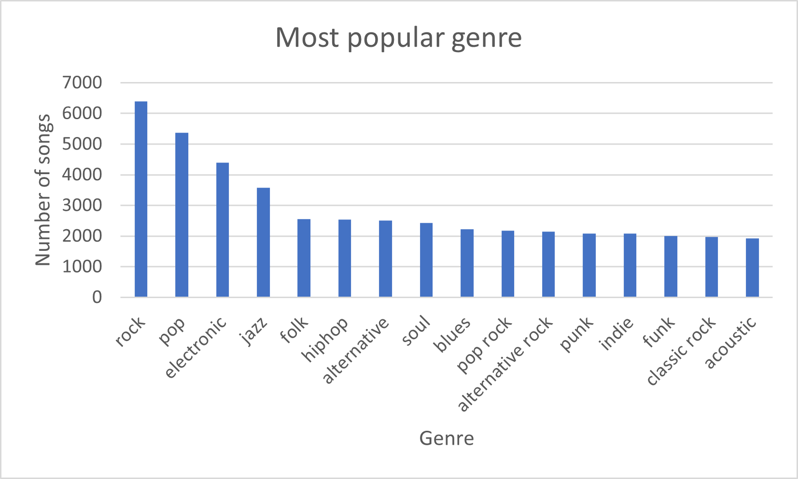

In the graph above, we can observe that the most popular genres are 'rock', 'pop', and 'electronic'.

- Which country has the highest number of artists?

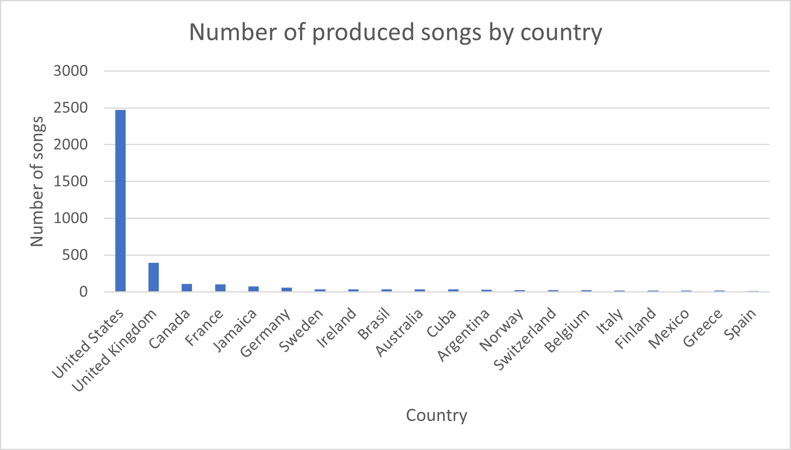

Not surprisingly, the country with the highest number of artists is the United States, which has been and remains a significant player in the music industry, followed by the United Kingdom.

- The year that has the highest number of songs produced is 2000.

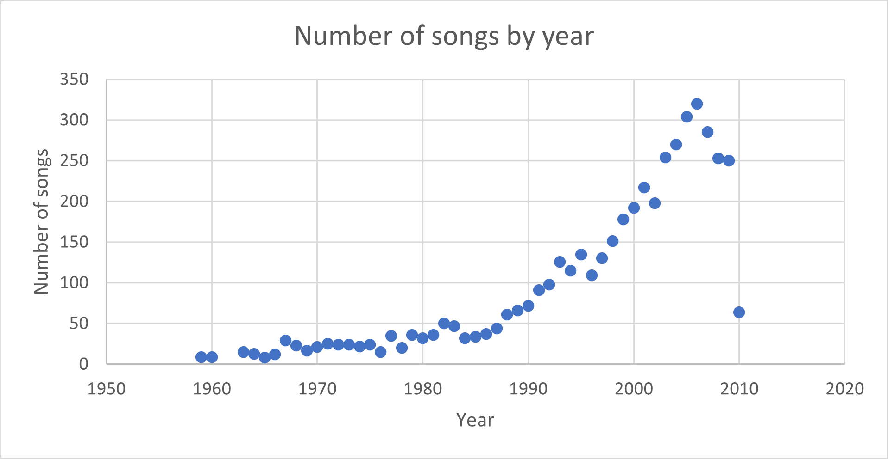

The year with the highest number of songs produced is 2006. We can observe that over time, the number of songs produced steadily increases, particularly from the 1990s onwards. In 2010, the number is significantly lower compared to the values of the 2000s, which can be explained by the fact that our dataset includes data only up to 2010.

#### Question 2

- What is the average loudness and average BPM (beats per minute) by musical genre?

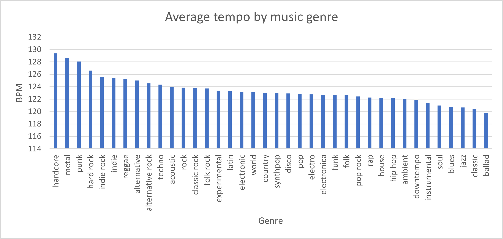

We can see that the beats per minute for each genre on average range between 120 and 130 BPM. The genre "hardcore" takes the lead with 129 BPM, known for its high energy and very fast tempos.

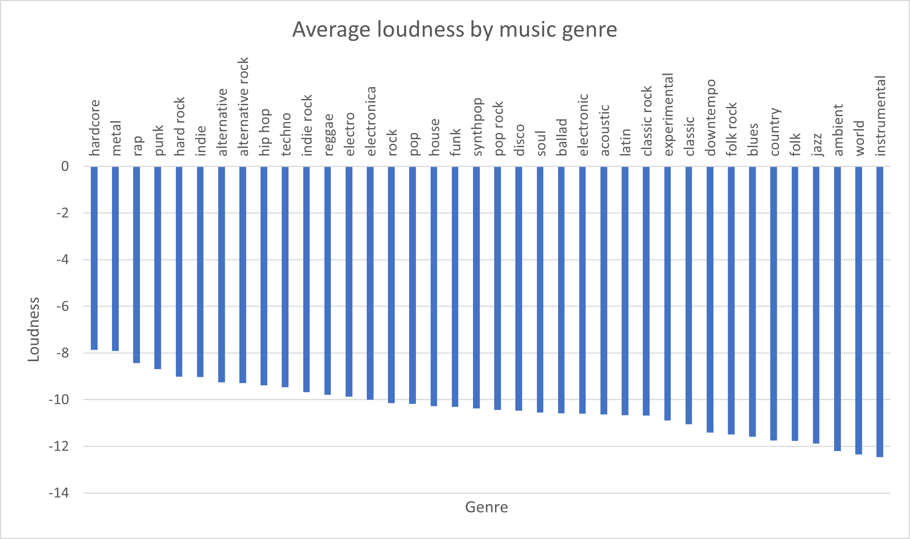

The loudness corresponds to the difference between the minimum and maximum sound levels. It characterizes the sound stability of a piece of music. For example, rock music tends to have a much higher loudness due to the type of instruments used (electric guitar, bass, etc.).

#### Question 3

-  Classification on artiste_genre: Model fine tuning results
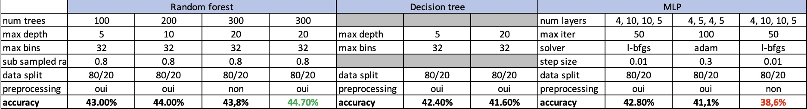

Random Forest: The accuracy ranges from 43.00% to 44.00%, with the highest accuracy achieved at 200 trees. The accuracy is relatively consistent across different max depths.
Decision Tree: The accuracy ranges from 44.70% to 38.6%, with the highest accuracy achieved at a max depth of 5. Increasing the max depth to 20 leads to a decrease in accuracy.
MLP: The accuracy ranges from 42.40% to 41.1%. It seems that increasing the number of layers or iterations does not necessarily lead to higher accuracy. The choice of solver and step size can also affect accuracy, but not in our case.
Overall, the Random Forest model performs slightly better than the Decision Tree and MLP models based on the provided accuracy results. 

We also added a gridSearch to find the optimal pair of hyperparameter that maximizes accuracy. Here are the results:
```
Best Model Parameters:
maxBins: 50
impurity: gini
maxDepth: 5
subsamplingRate: 0.8
numTrees: 200
```
And finally performed a cross validation from the optimal set of parameters found previously to also maximize the accuracy of our model shuffling 5 fold our dataset. Here's the final result: 4280228556034745.

Overall, the gridSearch et the cross validation didn't improve much the accuracy of our model. As a matter of fact, all models seem to output simiar accuracies so the problem may lie inside the data lebeling itself, and since we do not know how the dataset was labeled, it will be difficult to find any correlation.

=====
For clustering, we performed a selection of the number of clusters to obtain the highest signature score.

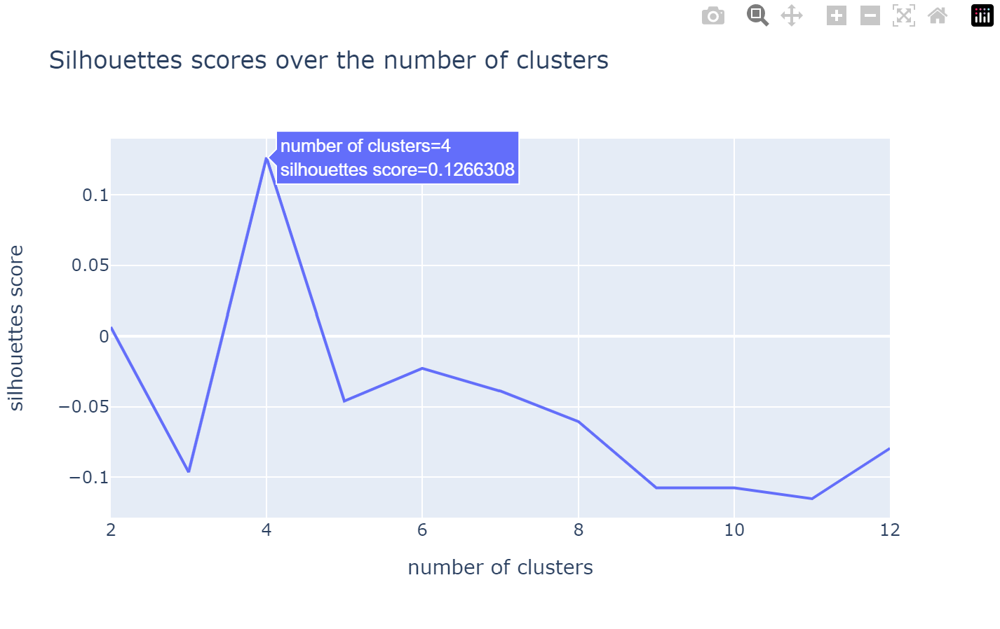

We then display the feature means for the k-means performed with this number of clusters.

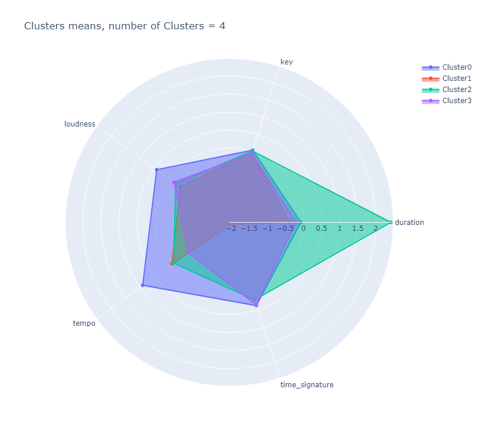

We can then analyze if the obtained songs are consistent with the feature means. In this example, we have a higher tempo than the average for cluster 0, and a higher duration for cluster 2. By displaying the first 20 songs from these two clusters, we can see that the tempo of cluster 0 is indeed higher than in cluster 2.

```md
First 20 musics of cluster 0 :
+------------------------+------------------------------------------------+---------+-------+--------------------------------------------------------------------------------------+
|artist_name             |title                                           |duration |tempo  |artist_genre                                                                          |
+------------------------+------------------------------------------------+---------+-------+--------------------------------------------------------------------------------------+
|Amorphis                |Misery Path (From the Privilege of Evil)        |255.03302|175.673|['Progressive metal', 'death metal', 'Melodic Death Metal', 'doom metal', 'seen live']|
|Atreyu                  |You Eclipsed By Me (Album Version)              |218.90567|157.715|['metalcore', 'hardcore', 'metal', 'screamo', 'rock']                                 |
|Spoonie Gee             |Spoonie Is Back                                 |393.63873|135.503|['Hip-Hop', 'rap', '80s', 'hip hop', 'old school']                                    |
|UFO                     |Out In The Street (Live) (2008 Digital Remaster)|314.17424|131.5  |['hard rock', 'classic rock', 'rock', 'heavy metal', 'Progressive rock']              |
|Dave Hollister          |Calm Da Seas                                    |258.16771|117.936|['rnb', 'soul', 'Dave Hollister', 'r and b', 'gospel']                                |
|Bob Marley & The Wailers|Rainbow Country (Red Gold And Green Version)    |258.29832|152.99 |['reggae', 'roots reggae', 'ska', 'roots', 'classic rock']                            |
|Naseebo Lal             |Dholna Dholna                                   |376.16281|151.983|['Punjabi', 'Bhangra', 'Indian', 'folk', 'World Music']                               |
|Jimmy Riley             |Amaze                                           |216.39791|159.943|['reggae', 'roots reggae', 'seen live', 'jamaica', 'jamaican']                        |
|The Cortinas            |Radio Rape                                      |219.01016|134.985|['punk', 'punk rock', 'Punk 77', 'british', 'bristol']                                |
|Jongo Trio              |Cavaleiro De Aruanda                            |157.72689|144.581|['Bossa Nova', 'brasil', 'jazz', 'mpb', 'easy listening']                             |
|George Nooks            |TELL ME WHY                                     |221.90975|152.172|['reggae', 'lovers rock', 'dancehall', 'jamaica', 'George Nooks']                     |
|HA-ASH                  |Amor a Medias                                   |253.90975|136.945|['pop', 'latin pop', 'latin', 'mexico', 'Espanol']                                    |
|Radiohead               |15 Step                                         |237.21751|188.91 |['alternative', 'alternative rock', 'rock', 'indie', 'electronic']                    |
|Bon Jovi                |Raise Your Hands                                |311.27465|139.95 |['rock', 'hard rock', 'classic rock', '80s', 'hair metal']                            |
|John Holt               |I Need a Veggie                                 |228.30975|131.297|['reggae', 'roots reggae', 'rocksteady', 'jamaica', 'roots']                          |
|Capleton                |Cry For Love                                    |216.81587|137.425|['reggae', 'dancehall', 'ragga', 'jamaica', 'roots']                                  |
|Kisha                   |Wohär dr Wind wäiht                             |203.04934|152.792|['swiss', 'seen live', 'Mundart', 'pop', 'switzerland']                               |
|DJ Vix                  |Putt Jhatt Da Gulabi Phull Varga                |98.76853 |195.755|['Bhangra', 'Punjabi', 'Indian', 'Desi Artist', 'desi']                               |
|Crematorium             |Unlearn                                         |210.1024 |122.186|['death metal', 'deathcore', 'black metal', 'metal', 'hardcore']                      |
|Månegarm                |Vargbrodern Talar                               |92.76036 |163.086|['viking metal', 'folk metal', 'black metal', 'pagan metal', 'swedish']               |
+------------------------+------------------------------------------------+---------+-------+--------------------------------------------------------------------------------------+
```

We can also observe that the duration of the songs in cluster 2 is on average much higher than the duration of the songs in cluster 0.

```md
First 20 musics of cluster 2 :
+----------------------------------------------------+-------------------------------------------------------------+---------+-------+-----------------------------------------------------------------------------------+
|artist_name                                         |title                                                        |duration |tempo  |artist_genre                                                                       |
+----------------------------------------------------+-------------------------------------------------------------+---------+-------+-----------------------------------------------------------------------------------+
|Mistress                                            |Shovel                                                       |580.70159|146.331|['grindcore', 'Sludge', 'sludge metal', 'death metal', 'sludgecore']               |
|Koffi Olomidé                                       |Bennie                                                       |625.78893|89.572 |['congo', 'soukous', 'african', 'africa', 'World Music']                           |
|Philippe Sarde                                      |Grand Frère                                                  |528.22159|137.658|['Soundtrack', 'french', 'Classical', 'contemporary classical', '70s']             |
|Hot Tuna                                            |Parchman Farm                                                |461.71383|138.512|['blues', 'blues rock', 'rock', 'classic rock', 'folk']                            |
|Hacken Lee                                          |Zhi Xiang Ni hui Yi                                          |424.82893|124.984|['spotify']                                                                        |
|Britney Spears                                      |3                                                            |465.47546|131.999|['pop', 'dance', 'female vocalists', 'Britney Spears', 'legend']                   |
|Theodor Zox                                         |System of Play                                               |381.23057|83.991 |['minimal', 'minimal techno', 'techno', 'tech house', 'House']                     |
|Gonzalo Rubalcaba                                   |Yesterdays                                                   |483.39546|70.256 |['jazz', 'jazz piano', 'piano', 'latin', 'Cuban Jazz']                             |
|David Taylor                                        |Concertino for Bass Trombone and Trombone Choir              |600.11057|144.252|['Avant-Garde', 'Classical', 'multiple artists', 'trombone music', 'bass trombone']|
|L.A.V.I                                             |Mui Mal_ Animal                                              |565.96853|0.0    |[]                                                                                 |
|David & Steve Gordon                                |Faithkeeper_ Part 1                                          |532.27057|131.991|['new age', 'native american', 'ambient', 'world', 'Neo-Pagan']                    |
|Ann Lee                                             |So deep                                                      |380.08118|131.999|['dance', 'pop', 'eurodance', 'female vocalists', 'electronic']                    |
|Bill Engvall                                        |T-Ball and Indian Guides (LP Version)                        |482.21995|112.964|['comedy', 'standup comedy', 'funny', 'stand-up comedy', 'stand-up']               |
|30 Seconds To Mars                                  |Year Zero                                                    |472.39791|121.518|['alternative rock', 'rock', 'alternative', 'emo', 'indie']                        |
|Herbert von Karajan and Turin RAI Symphony Orchestra|Symphony No. 7 in A Major_ Op. 92: I. Poco sostenuto - Vivace|770.35057|92.731 |[]                                                                                 |
|Joi                                                 |Prem                                                         |425.16853|120.006|['soul', 'rnb', 'funk', 'Neo-Soul', 'female vocalists']                            |
|Christian Quast                                     |Jugglin' Clown                                               |485.14567|126.914|['minimal', 'electronic', 'techno', 'Kickboxer', 'boxer recordings']               |
|Deodato                                             |Groovitation (Album Version)                                 |371.33016|110.909|['jazz', 'funk', 'Fusion', 'latin', 'brazilian']                                   |
|Open Hand                                           |Never Alone                                                  |486.97424|86.308 |['rock', 'alternative rock', 'emo', 'alternative', 'indie']                        |
|Rachael Starr                                       |Till There Was You (John Creamer & Stephane K Remix)         |608.23465|127.996|['House', 'trance', 'dance', 'female vocal', 'electronic']                         |
+----------------------------------------------------+-------------------------------------------------------------+---------+-------+-----------------------------------------------------------------------------------+
```

#### Question 4

As expected, the number of artists per cluster decreases as the number of clusters increases. This has an impact on other measures as well. Indeed, when the clusters are smaller, there is less chance of finding the right artists in the cluster.

Overall, we can see that the created clusters do not correspond to the similar artists given in the dataset.

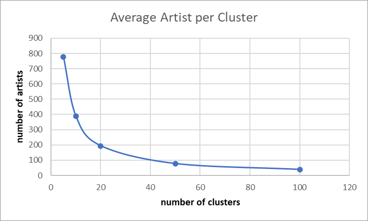

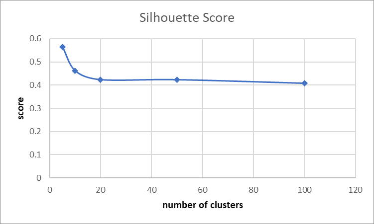

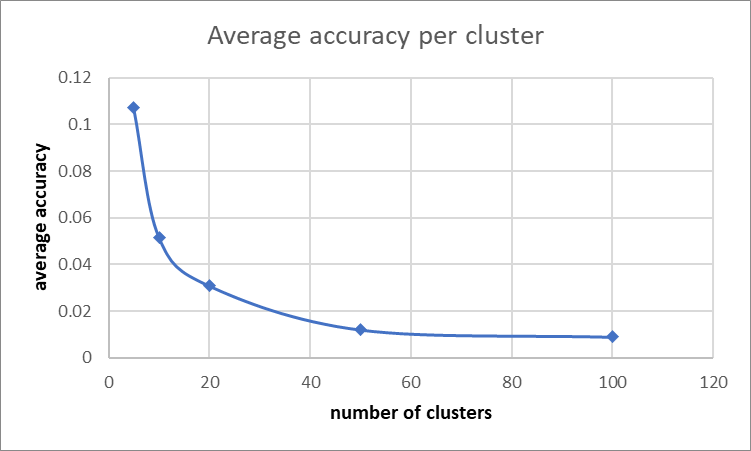

### Futur openings

To more comfortably display the obtained results, we could have performed the project in a Zeppelin notebook.

Due to RAM constraints, we were unable to use the entire dataset, which weighs 280 GB. One improvement would be to run the code in the cloud to support a larger dataset.

To achieve better quality music and artist classification, a possible enhancement would be to perform feature selection to identify the most useful characteristics for classifying our music.

Another improvement would be to create new features from the existing features in the dataset, providing more relevant information for making classifications.

